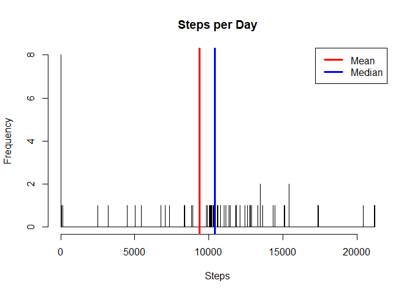
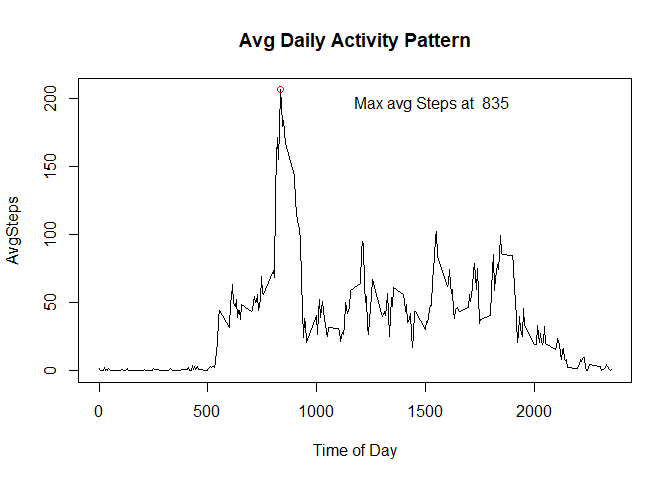
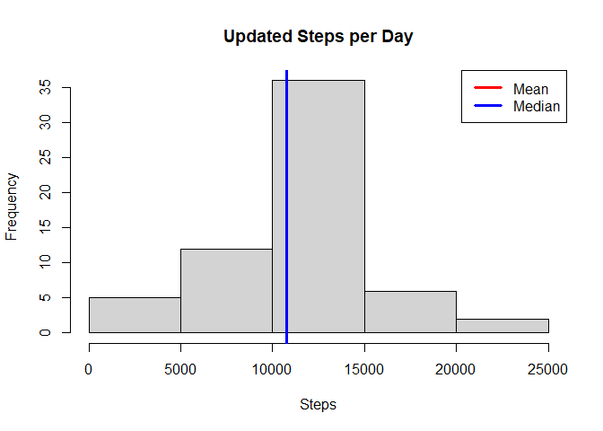
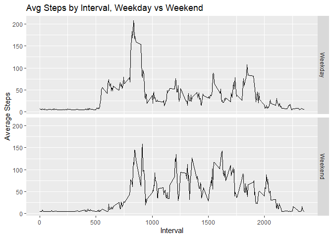

## Loading and preprocessing the data

```r
unzip("activity.zip")
activity<-read.csv("activity.csv")
activity$date<- as.Date(activity$date, format= "%Y-%m-%d")
```

## What is mean total number of steps taken per day?


```r
#mean total number of steps taken per day
stepsTot<- with(activity, tapply(steps, date,sum, na.rm=TRUE))
stepsTotdf<- data.frame(Date=names(stepsTot), Steps=stepsTot)
with(stepsTotdf, hist(Steps, main="Steps per Day", breaks=2500))
meanS<-mean(stepsTotdf$Steps)
abline(v=meanS, col="red", lwd=3)
medS<- median(stepsTotdf$Steps)
abline(v=medS, col="blue", lwd=3)
legend("topright", legend=c("Mean", "Median"), col=c("red", "blue"), lwd=3)
```

<!-- -->

The mean steps per day is 9354.2295082 and the median steps per day is 10395.

## What is the average daily activity pattern?

```r
intervalavg<- with(activity, tapply(steps, interval, mean, na.rm=TRUE))
intervalAvgdf<- data.frame(Interval=names(intervalavg), AvgSteps=intervalavg)
with(intervalAvgdf, plot(Interval, AvgSteps,type="l", xlab="Time of Day",
                         main="Avg Daily Activity Pattern"))
maxInterval<-intervalAvgdf[intervalAvgdf$AvgSteps == max(intervalAvgdf$AvgSteps),1]
points(maxInterval, max(intervalAvgdf$AvgSteps), pch=21, col="red")
text(as.character(as.numeric(maxInterval) + 700), max(intervalAvgdf$AvgSteps)- 10, 
     labels=paste("Max avg Steps at ", maxInterval))
```

<!-- -->

## Imputing missing values


```r
#calculate the total number of missing values
numMissingValues<- colSums(is.na(activity))
rowsNA<-sum(numMissingValues)
```
The number of rows with missing values is 2304. Let's replace those missing
values with the average steps and run our graph again.


```r
activityPlus<- activity
activityPlus$steps[is.na(activityPlus$steps)]<-mean(activityPlus$steps, na.rm=TRUE)

UstepsTot<- with(activityPlus, tapply(steps, date,sum, na.rm=TRUE))
UstepsTotdf<- data.frame(Date=names(UstepsTot), Steps=UstepsTot)
with(UstepsTotdf, hist(Steps, main="Updated Steps per Day"))
UmeanS<- mean(UstepsTotdf$Steps)
abline(v=UmeanS, col="red", lwd=3)
UmedS<- median(UstepsTotdf$Steps)
abline(v=UmedS, col="blue", lwd=3)
legend("topright", legend=c("Mean", "Median"), col=c("red", "blue"), lwd=3)
```

<!-- -->

The updated mean steps per day is 1.0766189\times 10^{4} and the updated median steps per day is 1.0766189\times 10^{4}.


## Are there differences in activity patterns between weekdays and weekends?

```r
#updated dataframe is activityPlus
library(ggplot2)
dow<- weekdays(activityPlus$date)
dayType<- ifelse(dow == "Saturday" | dow == "Sunday","Weekend", "Weekday")
activityPlus$dayType<- as.factor(dayType)
intervalTypeavg<- with(activityPlus, aggregate(steps, list(Interval=interval, DayType = dayType), mean))

g<- ggplot(intervalTypeavg, aes(Interval, x)) + geom_line() +        facet_grid(DayType~.)
g<- g + labs(y="Average Steps", x="Interval", title = "Avg Steps by Interval, Weekday vs Weekend")
print(g)
```

<!-- -->


Looks like there is more steady movement on the weekends, but more total steps around 830 weekdays.
